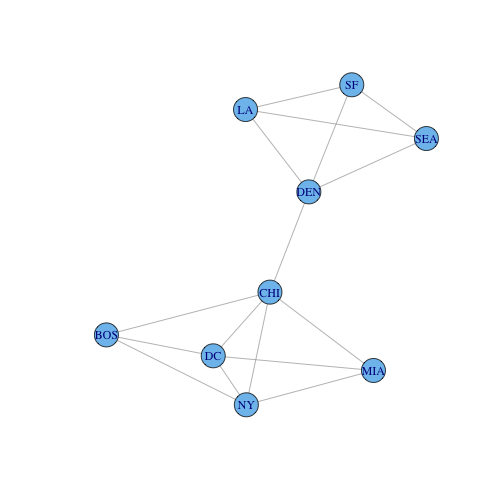
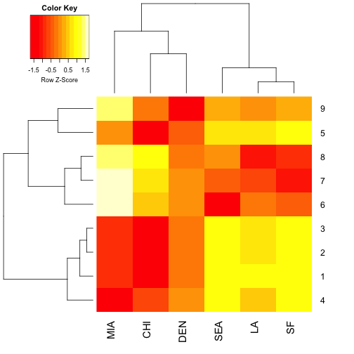
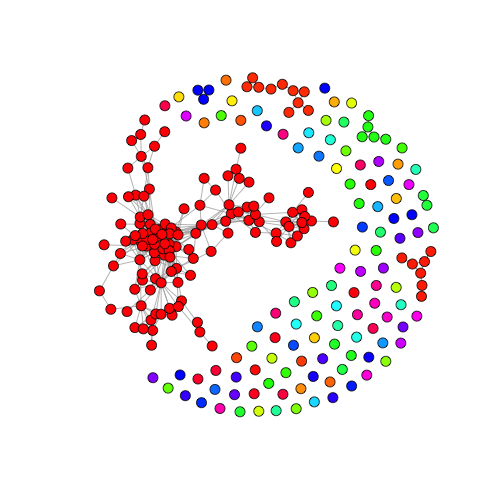
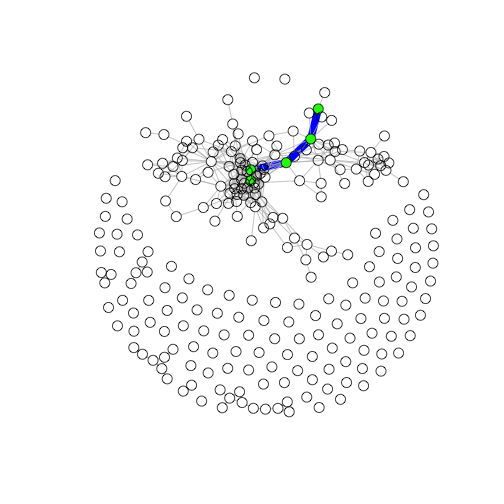

---
layout: lab
title: Genetic Networks 2 - Co-Expression 
hidden: true
tags:
     - networks
     - R
     - clustering
     - kmeans
     - RNA-seq 
     - graphs
--- 
# Biological Context 
In the past few weeks we have taken data off the sequencer, aligned the reads to our reference genome, calculated counts for the number of reads that mapped to each gene in our reference genome, found out what genes are differentially expressed between our genotype treatment combinations, and started to interpret the data using clustering. With these large data sets there is more than one way to look at the data. As biologists we need to critically evaluate what the data is telling us and interpret it using our knowledge of biological processes. In our case we have an environmental perturbation that we have imposed on the plants by altering the density of plants in a given pot. Understanding mechanistically how plants respond to crowding is important for understanding how plants grow and compete for resources in natural ecosystems, and how we might manipulate plants to grow optimally in agroecosystems. In our case, we have two genotypes of plants that show very different physiological and morphological responses to crowding. We have a lot of data, some quantitative, some observational, that support this. Plant growth, just like the growth of any organism, is a really complicated thing. Organisms have evolved to interact with the environment by taking in information from their surroundings and trying to alter their physiology and biochemistry to better live in that environment. We know a lot about the details of how these signals are intercepted by the organisms, but we know less how this translates to changes in biochemistry, physiology, development, growth, and ultimately reproductive outputs. In our case, plants recieve information about their neighbors through detecting changes in light quality through the phytochrome light receptors. This is a focus of the Maloof lab. You can read more generally about the way plants percieve these changes **[here](http://www.bioone.org/doi/full/10.1199/tab.0157)**. We want to understand how plants connect the upstream perception of environmental signals (in this case the presence of neighbors) and how this information cascades through the biological network of the organism to affect the downstream outputs of physiological and developmental changes. To get an approximation of what is going on in the biological network we need to work with an intermediate form of biological information: gene expression. Although there are important limitations to only using gene expression data which we will discuss during the lecture, it should provide some clues as to how to best connect the upstream environmental perception with the downstream growth outputs.

# Review
In the last section you learned about techniques to reduce our high-dimensional gene expression data by projecting them onto a simpler two dimensional representation. The axes of this projection describes the two largest axes of variation contained within the dataset. Each of these axes of variation is called a principle component (PC for short). During the lecture last time, I used the example of trying to summarize a 3D object by projecting a shadow of the object on the dry erase board. If we can only observe the shadow of the object, we have reduced the object from being a 3D shape into a 2D summary. We also discussed how the shape of the 2D summary shadow would depend on how the 3D object was oriented in 3D space and what angle the light source was at to cast the shadow onto the dry erase board. In our high-dimensional gene expression data set we can define the largest axes of variation in the dataset and plot them onto a 2D plane. 
K-means clustering allows us to search this higher dimensional space for patterns in the data, find the patterns, and assign cluster numbers to each gene in the dataset. When we combine PC plots with k-means plots we can assign a color value to each cluster like you did for exercise 8. We will now build on these ideas of data reduction and visualization to build a correlation based gene co-expression network. 

# Networks Intuition
In our example dataset from last time we used US cities to represent individual nodes that cluster together with one another based on **relationships** of geographic distances between each city. To put this in network terminology, each of the individual cities we could define as a **node**.

**(NY)**    

**(BOS)**   

**(DC)**

The relationships, or **edges**, between the city nodes were defined by measurements of geographic distance.

**(NY)--MILES--(BOS)**

**(NY)--MILES--(SF)**

Okay, lets load up our city data again and get started by playing with some examples!


```bash
wget https://raw.githubusercontent.com/rjcmarkelz/BIS180L_web/feature-networks/data/DEgenes_GxE.csv
wget https://raw.githubusercontent.com/rjcmarkelz/BIS180L_web/feature-networks/data/voom_transform_brassica.csv
```

```
## Error in running command bash
```

Infile the data into R. 


```r
# make sure to change the path
cities <- read.table("/Users/Cody_2/git.repos/BIS180L_web/data/us_cities.txt", sep = "\t", header = TRUE)
rownames(cities) <- cities$X #make first column the rownames
cities <- cities[,-1] #remove first column
cities <- as.matrix(cities) #convert to matrix
cities # print matrix
```

```
##       BOS   NY   DC  MIA  CHI  SEA   SF   LA  DEN
## BOS     0  206  429 1504  963 2976 3095 2979 1949
## NY    206    0  233 1308  802 2815 2934 2786 1771
## DC    429  233    0 1075  671 2684 2799 2631 1616
## MIA  1504 1308 1075    0 1329 3273 3053 2687 2037
## CHI   963  802  671 1329    0 2013 2142 2054  996
## SEA  2976 2815 2684 3273 2013    0  808 1131 1307
## SF   3095 2934 2799 3053 2142  808    0  379 1235
## LA   2979 2786 2631 2687 2054 1131  379    0 1059
## DEN  1949 1771 1616 2037  996 1307 1235 1059    0
```
Take a look at the printed matrix. What if we were an airline and we wanted to calculate what the best route from city to city was, but the planes that we have in our fleet have a maximum fuel range of only 1500 miles. This would put a constraint on our city network. Cities with distances between them greater than 1500 miles would no longer be reachable directly. Their edge value would become a zero.
Likewise, if two cities are within 1500 miles, their edge value would become 1. This 1 or 0 representation of the network is called the network **adjacency** matrix. 

Lets create an adjacency matrix for our test dataset.


```r
cities_mat <- cities # leave original matrix intact
cities_mat[cities <= 1500] <- 1
cities_mat[cities >= 1500] <- 0
diag(cities_mat) <- 0 # we do not have to fly within each of cities :)
cities_mat # check out the adjacency matrix
```

```
##      BOS NY DC MIA CHI SEA SF LA DEN
## BOS    0  1  1   0   1   0  0  0   0
## NY     1  0  1   1   1   0  0  0   0
## DC     1  1  0   1   1   0  0  0   0
## MIA    0  1  1   0   1   0  0  0   0
## CHI    1  1  1   1   0   0  0  0   1
## SEA    0  0  0   0   0   0  1  1   1
## SF     0  0  0   0   0   1  0  1   1
## LA     0  0  0   0   0   1  1  0   1
## DEN    0  0  0   0   1   1  1  1   0
```
**Exercise 1:**
Based on this 0 or 1 representation of our network, what city is the most highly connected? *Hint: sum the values down a column OR across a row for each city*

What if you were to extend the range to 2000 miles in the above code. Does the highest connected city change? If so explain. 

##Plotting networks
Now plot this example to see the connections based on the 2000 mile distance cutoff. It should show the same connections as in your adjacency matrix. 


```r
install.packages("igraph") # Download and install the package
```

```
## Installing package into '/Users/Cody_2/Library/R/3.1/library'
## (as 'lib' is unspecified)
```

```
## Error in contrib.url(repos, "source"): trying to use CRAN without setting a mirror
```

```r
library(igraph) # load package
```

```
## Warning: package 'igraph' was built under R version 3.1.2
```

```
## Loading required package: methods
```

```r
# make sure to use the 2000 mile distance cutoff 
cities_graph2 <- graph.adjacency(cities_mat, "undirected")
plot.igraph(cities_graph2)
```

 
**Exercise 2:**
What is the total number of nodes you can see in your plot? 
What is the total number of edges you can see in your plot?

**Exercise 3:**
Re-calculate the adjacency matrix with the cutoff value at 2300. Calculate the number of edges using the following code. What do you get?


```r
sum(cities_mat)/2 # divide by 2 because the matrix has 2 values for each edge
```
You can see that this representation of what was once a complicated matrix has been simplified to 1 and 0. This is a very useful simplification that we will take advantage of when trying construct biological networks. How can we extend the city analogy to biology? We could define each gene as a node and the relationships/edges between the nodes as some value that we can calculate to make an adjacency matrix. 

**(Gene1)**    

**(Gene2)**    

**(Gene3)**

**(Gene1)--Value?--(Gene2)**

We do not have geographic distance between genes, but we do have observations of each gene's relative expression value across our many Genotype by Environment by Tissue type combinations. We can reduce this data down if we did a simple correlation based analysis of the data. We could calculate a correlation coefficient (a value between -1 and +1) for each gene with every other gene in our data set across all the samples. So then our network would look like this for all gene pairs:

**(Gene1)--Correlation--(Gene2)**

There are **MANY** important caveats and limitations to this approach outlined **[here](http://www.nature.com/nrg/journal/v16/n2/full/nrg3868.html)**, but that does not mean that the method is not useful for helping us to interpret this data. If we look across our dataset and calculate a correlation coefficient between each gene we would have edge values to construct a network. However, to start with an adjacency matrix of our simple gene network lets put some constraints on what we want to call an edge. Lets say greater than the 0.7 correlation (+ or -) we will draw an edge value of 1, if not it will get a 0. This is called an unsigned network. There is no sign associated with the positive or negative correlation values. 

**(Gene1)--(+0.9)--(Gene2)**

**(Gene2)--(-0.76)--(Gene3)**

**(Gene1)--(+0.50)--(Gene3)**

**(Gene3)--(-0.69)--(Gene4)**

**Exercise 4:**
Fill in the following 0 or 1 values for our gene network above.
**(Gene1)--(?)--(Gene2)**

**(Gene2)--(?)--(Gene3)**

**(Gene1)--(?)--(Gene3)**

**(Gene3)--(?)--(Gene4)**

Okay, I think now that we have the basic concepts, lets work with the larger gene expression data set. 

In following up on the pattern that we observed in our clustering analysis on Tuesday I found out that the leaf samples that appeared to be part of thier own cluster (especially in the heat map) were bad libraries. **This demonstrates the importance of visualizing your data as often as possible during an analysis to catch potential errors** We will remove these libraries from our analysis today.


```r
genes <- read.table("/Users/Cody_2/git.repos/BIS180L_web/data/voom_transform_brassica.csv", sep = ",", header = TRUE)
genes <- genes[,-c(38,42,46)] # remove questionable library columns
DE_genes <- read.table("/Users/Cody_2/git.repos/BIS180L_web/data/DEgenes_GxE.csv", sep = ",")
DE_gene_names <- rownames(DE_genes)
GxE_counts <- as.data.frame(genes[DE_gene_names,])
genes_cor <- cor(t(GxE_counts))

# take a look at the distibution of gene gene correlations
hist(genes_cor[upper.tri(genes_cor)]) # slightly right skewed
```

 

```r
genes_adj <- abs(genes_cor) > 0.85
diag(genes_adj) <- 0 # important step
```

**Exercise 5:**
Now we can do some calculations. If our cutoff is 0.85, how many edges do we have in our 255 node network? What if we increase our cutoff to 0.90?

**Exercise 6:**
Use the following code to plot our networks using different thresholds for connectivity. What patterns do you see in the visualization of this data? *Note: the second plot will take a while to render*


```r
genes_adj95 <- abs(genes_cor) > 0.95
diag(genes_adj95) <- 0 

gene_graph95 <- graph.adjacency(genes_adj95, mode = "undirected") #convert adjacency to graph
comps <- clusters(gene_graph95)$membership                        #define gene cluster membership
colbar <- rainbow(max(comps)+1)                                   #define colors
V(gene_graph95)$color <- colbar[comps+1]                          #assign colors to nodes
plot(gene_graph95, layout = layout.fruchterman.reingold, vertex.size = 6, vertex.label = NA)
```

 

```r
#this one will take a little while to render
genes_adj85 <- abs(genes_cor) > 0.85
diag(genes_adj85) <- 0 
gene_graph85 <- graph.adjacency(genes_adj85, mode = "undirected")
comps <- clusters(gene_graph85)$membership
colbar <- rainbow(max(comps)+1)
V(gene_graph85)$color <- colbar[comps+1]
plot(gene_graph85, layout=layout.fruchterman.reingold, vertex.size=6, vertex.label=NA)
```

 

##Graph Statistics for Network Comparison
Graph density is a measure of the total number of edges between nodes out of the total possible number of edges between nodes (ever gene is connected to every other gene). It is useful metric to calculate if you want to compare two networks with a similar number of nodes. We could have split our data into the two treatments (DP and NDP) at the beginning of our analysis, built seperate networks for each, then used metrics like this to compare network properties between treatments. 

Another really cool property of graphs is we can ask how connected any two nodes are to one another (if at all) by performing a path analysis through the network. Think about the cities network. If we wanted to get from BOS to SF but we had our plane fuel constraints we could not fly between the two cities on a direct flight. We will have to settle for a layover. A path analysis can find the flight path between cities connecting BOS and SF in the shortest amount of layovers. In a biology context it is a little more abstract, but we are asking the network if there is a way that we can get from gene A to gene B by following the edges in the network. Plotting this will help understand!

**Exercise 7:**
 Use the following code to answer these two questions: In gene_graph85, what is the total graph density? In gene_graph85, what is the average path length? 


```r
graph.density(gene_graph85)
average.path.length(gene_graph85)
```
Now lets plot the distance between two specific nodes. Rather annoyingly igraph does not have an easy way to input gene names for the path analysis. It requires that you provide the numeric row number of gene A and how you want to compare that to the column number of gene B. I have written this additional piece of code to show you how this works. We get the shortest paths between ALL genes in the network and then print the results. We are interested in visualizing the path between Bra033034 (row number 2) and 


```r
gene_graph85 <- graph.adjacency(genes_adj85, mode = "undirected")
distMatrix <- shortest.paths(gene_graph85, v = V(gene_graph85), to = V(gene_graph85))
head(distMatrix)[,1:10]
```

```
##           Bra010821 Bra033034 Bra035334 Bra003598 Bra016182 Bra013164
## Bra010821         0       Inf       Inf       Inf       Inf       Inf
## Bra033034       Inf         0       Inf       Inf       Inf         4
## Bra035334       Inf       Inf         0       Inf       Inf       Inf
## Bra003598       Inf       Inf       Inf         0       Inf       Inf
## Bra016182       Inf       Inf       Inf       Inf         0       Inf
## Bra013164       Inf         4       Inf       Inf       Inf         0
##           Bra009406 Bra033856 Bra011196 Bra041036
## Bra010821       Inf       Inf       Inf       Inf
## Bra033034         6         3       Inf         3
## Bra035334       Inf       Inf       Inf       Inf
## Bra003598       Inf       Inf       Inf       Inf
## Bra016182       Inf       Inf       Inf       Inf
## Bra013164         3         4       Inf         4
```

```r
pl <- get.shortest.paths(gene_graph85, 2, 6)$vpath[[1]] # pull paths between node 2 and 6

V(gene_graph85)[pl]$color <- paste("green")          # define node color
E(gene_graph85)$color <- paste("grey")               # define default edge color
E(gene_graph85, path = pl)$color <- paste("blue")    # define edge color
E(gene_graph85, path = pl)$width <- 10               # define edge width
plot(gene_graph85, layout = layout.fruchterman.reingold, vertex.size = 6, vertex.label = NA)
```

 

**Exercise 8:**
Using what you know about graphs, repeat your analysis of the smaller cities matrix. Show your code to answer these questions.
What is the graph density of the cities network with a 1500 mile flight range?
What is the average path length of the cities network with a 1500 mile flight range?
Find the shortest path between SEA and DC with 1500 mile flight range. Graph it.
Find the shortest path between SEA and DC with 2300 mile flight range. Graph it.

You have just done some complex analysis of networks. There are many more ways to think about this type of data. I hope that you can see the usefulness of this abstraction of the biological data. If you are interested in networks I recommend reading the igraph documentation. It has a lot of good information and citations for the theory of networks. 


