# Clustering Introduction
As you learned last week, when we are dealing with genome scale data it is hard to come up with very specific summaries of the data unless you know exactly the question you are trying to ask computationally. Today we will be talking about three different ways to cluster data and get visual summaries of the expression of all genes that had a significant GxE interaction. Once we have these clusters, it allows us to ask further more detailed questions such as what GO categories are enriched in each cluster, or are there specfic metabolic pathways contained in the clusters? While clustering can be used in an exploratory way, the basics you will be learning today have been extended to very sophisticated statistical/machine learning methods used across many disciplines. In fact, there are many different methods used for clustering in R outlined in this **CRAN VIEW** link.

The two clustering methods that we will be exploring are hierarchical clustering and k-means. These have important similarities and differences that we will discuss in detail throughout today. The basic idea with clustering is to find how similar the rows and/or columns in the dataset are based on the values contained within the data frame. You have already used a similar technique last week when you produced the MDS plot 'r plotMDS(dge.data, method = "bcv")'. This visualization of the the samples in the dataset showed that samples from similar genotype and treatment combinations were plotted next to one another based on thier Biological Coefficient of Variation calculated across all of the counts of genes. 

# Hierarchical Clustering
An intuitive example is clustering the distances between know geographic locations, such as US Cities. I took this example from this website: http://www.analytictech.com/networks/hiclus.htm
 
1) Calculate a distance measure between all the row and column combinations in data set (think geographic distances between cities)
2) Start all the items in the data out as belonging to its own cluster (every city is its own cluster)
3) In the distance matrix, find the two closest points (find shortest distance between any two cities) 
4) Merge the two closest points into one cluster (merge BOS and NY in our example dataset)
5) Repeat steps 3 and 4 until all the items belong to a single large cluster

A special note: all the clusters at each merge take on the shortest distance between any one member of the cluster and the remaining clusters. For example, the distance between BOS and DC is 433 miles, but the distance between NY and DC is 233. Because BOS/NY are considered one cluster after our first round, thier cluster distance to DC is 233. All three of these cities are then merged into one cluster DC/NY/BOS.


```
## Error in read.table("us_cities.txt", sep = "\t", header = TRUE, row.names = TRUE): invalid 'row.names' specification
```

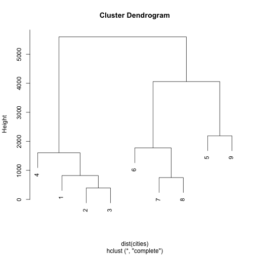 
**Exercise 1:**
What are the distances that define each split in the Westcoast side of the hclust plot? 
Hint 1: Start with SF and LA.
Hint 2: Print cities, you only need to look at the upper right triangle of data matrix.
SF/LA: ANSWER
SF/LA/SEA: ANSWER
SF/LA/SEA/DEN: ANSWER

What is the city pair and distance the joins the Eastcoast and Westcoast cities? Fill in the values.
Hint: Think midwest.
ANSWER/ANSWER: ANSWER

Now that we have that example out of the way, lets start using this technique on biological data. This week will be a review of all the cool data manipulation steps you have learned in past weeks. I would like to emphasize that printing dataframes (or parts of them) is a really fast way to get an idea about the data you are working with. Visual summaries like printed data, or plotting the data are often times the best way to make things are working the way they should be and you are more likely to catch errors. All spots where I would want to take a look at things I have included them. 

If you remember last week, you found some genes that had significant GxE in the internode tissue. We are going to be taking a look at those same genes again this week. I followed the same tutorial that you did last week. That dataset only had 12 RNA-seq libraries in it. However, that subset of data was part of a much larger study that we are going to explore today. This dataset consists of RNA-seq samples collected from 2 genotypes of **Brassica rapa** (R500 and IMB211) that were grown in either dense (DP) or non-dense planting (NDP) treatments. Upendra also collected tissue from multiple tissue types including: Leaf, Petiole, Internode (you worked with this last week), and silique (the plant seed pod). There were also 3 biological replicates of each combination (Rep 1, 2, 3). If your head is spinning thinking about all of this, do not worry, data visualization will come to the rescue here in a second.

Remember last week when we were concerned with what distribution the RNA-seq count data was coming from so that we could have a good statistical model of it? Well, if we want to perform good clustering we also need to think about this because most of the simplest clustering assumes data to be from a normal distribution. I have already taken care of this for you and if you are interested in more detail you can check out my script here.

Lets start by loading the two datasets. Then we can subset the larger full dataset to include only the genes that we are interested in.


```
## Warning in file(file, "rt"): cannot open file
## 'voom_transform_brassica.csv': No such file or directory
```

```
## Error in file(file, "rt"): cannot open the connection
```

Now that we have a dataframe containing our 255 significant GxE genes from the internode tissue, we can take a look at how these genes are acting across all tissues.

 
What a mess! We are too overplotted in this direction. How about if we cluster by column instead? Notice we have to transpose the data using *t()*. Also, make sure you stretch out the window so you can view it! #potential problem with Rstudio.

 
**Exercise 2:**
What is the general pattern in the h-clustering data? ANSWER
Using what you learned from the city example, what is the subcluster that looks very different than the rest of the samples? ANSWER
*Hint:* It is a group of 3 libraries. 


We have obtained a visual summary using h-clustering. Now what? Well we can go a little further and start to define some important sub-clusters within out tree. We can do this using the following function. 

 
**Exercise 3:**
With k = 4 as one of the arguments to the rect.hclust() function, what is the largest and smallest group contained within the rectangles? ANSWER
Play with the K-values. Find a new K-value between 3 and 7 and describe how the samples are falling out. ANSWER

You may have noticed that your results and potential interpretation of the data could change very dramatically based on the how many subclusters you choose! This is one of the main drawbacks with this technique. Fortunately there are other packages that can help us determine what sub-clusters have good support. Normally we would do 1000+ bootstrap samples, to get our support for each of the branches in the tree, but we we do not have lots of time today. The red values are the "Approximate Unbiased" p-values with numbers closer to 100 providing more support. Bootstraping is a popular resampling technique that you read about more *here*.


```
## Installing package into '/Users/Cody_2/Library/R/3.1/library'
## (as 'lib' is unspecified)
## The "ward" method has been renamed to "ward.D"; note new "ward.D2"
```

 
**Exercise 4:**
After running the 50 bootstrap samples, leave the plot open. Then change nboot up to 500. In general what happens to AU comparing the two plots by flipping between them?
ANSWER

We will be discussing more methods for choosing the number of clusters in the k-means section. Until then, we will expand what we learned about h-clustering to do a more sophisticated visualization of the data. 

# Heatmaps
Heatmaps are another way to visualize h-clustering results. Instead of looking at either the rows (genes) or the columns (samples) like we did the h-clustering examples we can view the entire data matrix at once. Well how do we do this? We could just print the matrix, but that would just be a bunch of numbers. Heatmaps take all the values within the data matrix and convert them to a color value. The human eye is really good at picking out patterns so lets convert that data matrix to a color value AND do some h-clustering. Although we can do this really easily with the heatmap() function, there is a small library that provides some additional functionality to the heatmaps. We will start with the cities example because it is small and easy to see what is going on. 


```
## Installing package into '/Users/Cody_2/Library/R/3.1/library'
## (as 'lib' is unspecified)
```

 
**Exercise 5:**
We used the scale rows option. This is necessary so that every row in the dataset will be on the same scale when visualized in the heatmap. Interpret what a dark red value and a light yellow value in the heatmap would mean for geographic distance with an example of the cities that are being compared. 
ANSWER

Now for some gene expression data. 

  
**Exercise 6:**
The genes are definately overplotted and we cannont tell one from another. However, what is the most obvious pattern that you can pick out from this data? Describe. 
*Hint* It will be a similar pattern as you noticed in the h-clustering.

**Exercise 7:**
In the similar way that you interpreted the color values of the heatmap for the city example, come up with a biological interpretation of the yellow vs. red color values in the heatmap. What would this mean for the pattern that you described in excercise 6? Discuss.

# k-means Clustering
To build some intuition about how these things work there is a cool R package called "animation". You do not have to run the following code, but I will use it to demonstrate a few examples with the projector. These examples are based directly on the **documentation** for the functions so if you wanted to look at how some other commonly used methods work with a visual summary I encourage you to check out this package on your own time.

 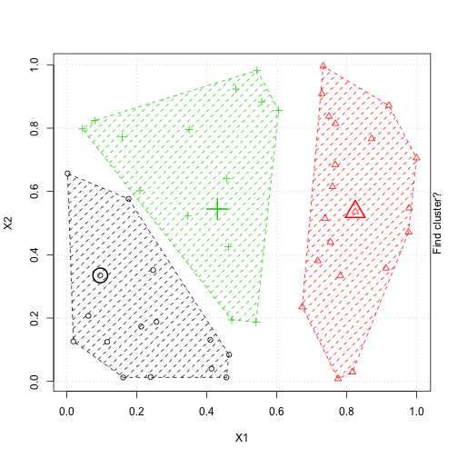 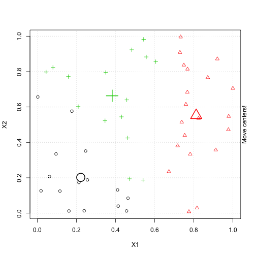   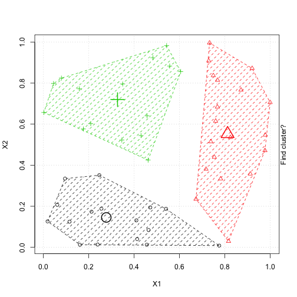  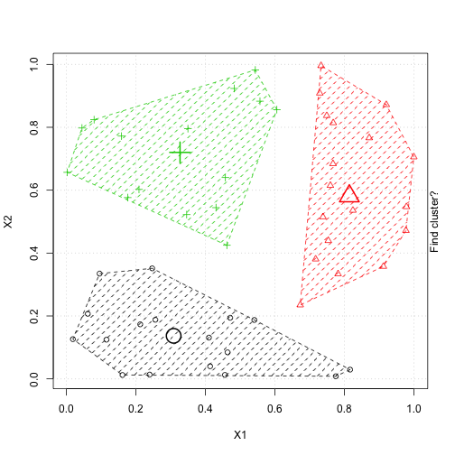  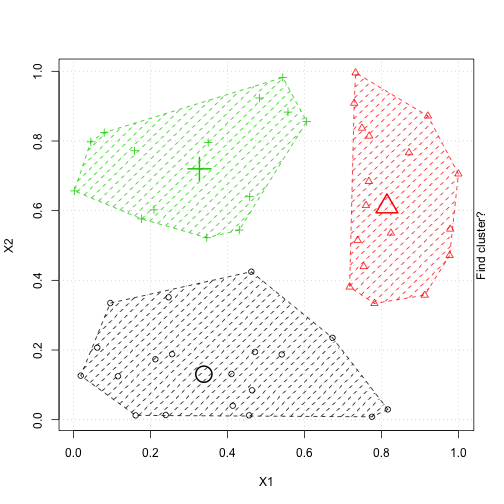 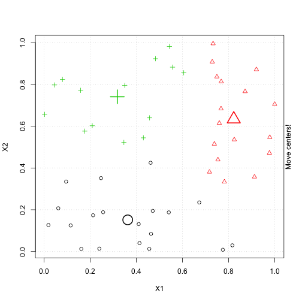  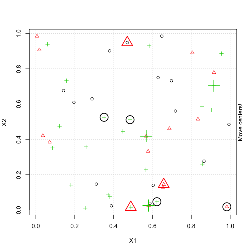     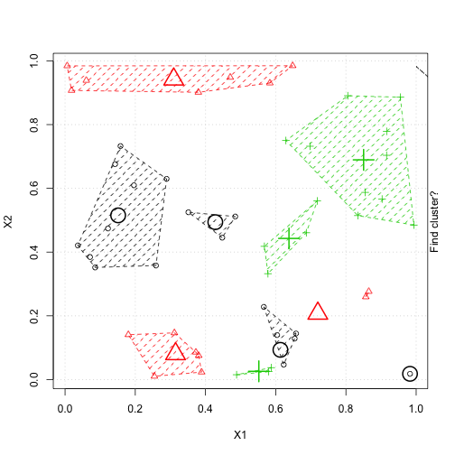 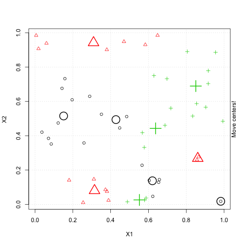 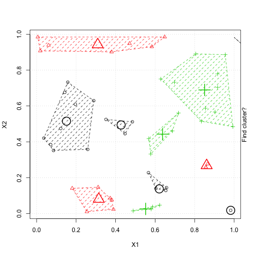  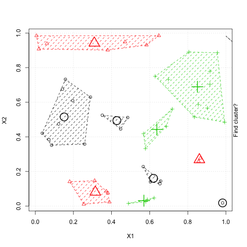   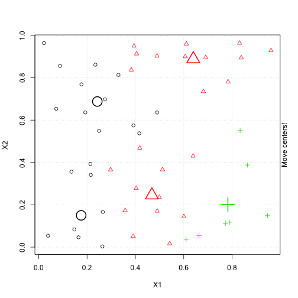   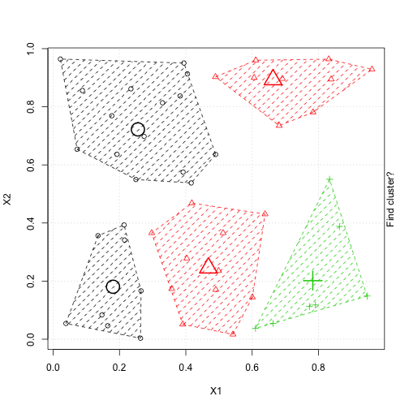    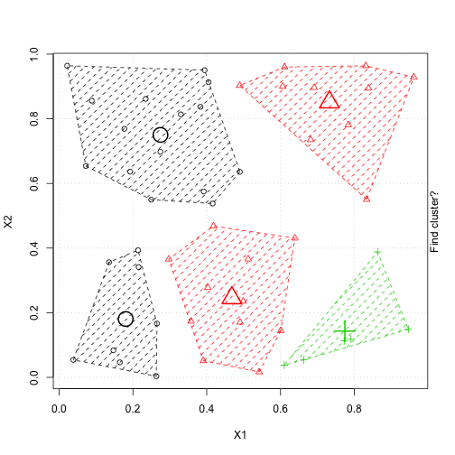 


```
## Downloading github repo sinhrks/ggfortify@master
## Installing ggfortify
## '/Library/Frameworks/R.framework/Resources/bin/R' --no-site-file  \
##   --no-environ --no-save --no-restore CMD INSTALL  \
##   '/private/var/folders/jh/6yqw6n710sj2xr9knz37tt0w0000gn/T/RtmpdpYBZB/devtools1e2a12bb467a/sinhrks-ggfortify-8df50ae'  \
##   --library='/Users/Cody_2/Library/R/3.1/library' --install-tests 
## 
## Reloading installed ggfortify
```

 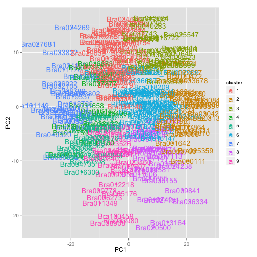  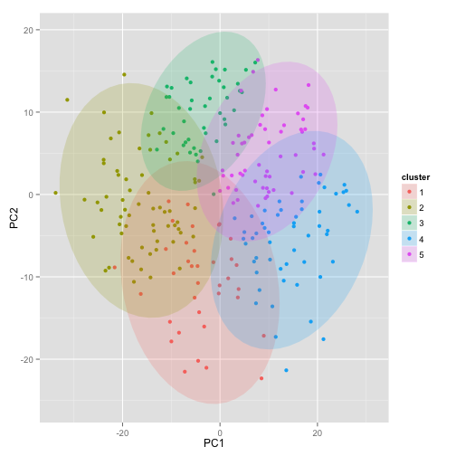 
Now that we have some clusters to work with we will want to think about plotting them.


